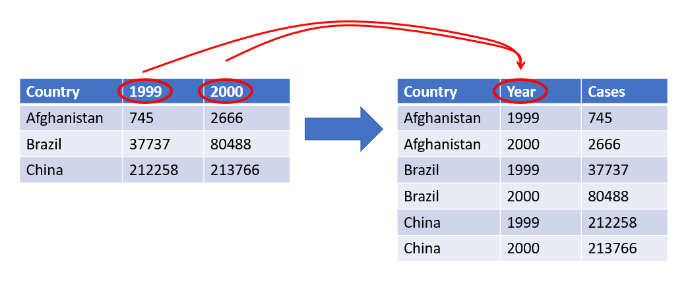
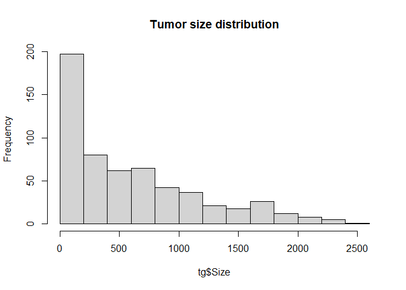
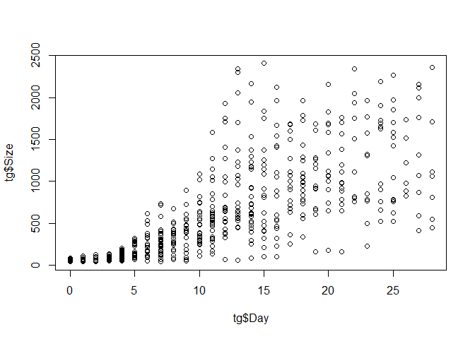
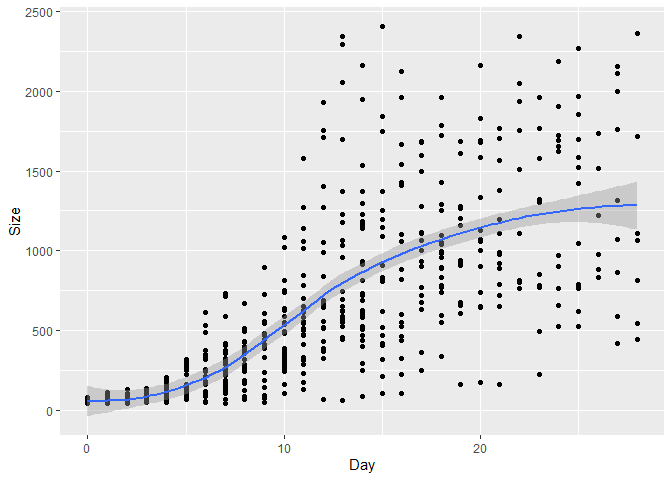
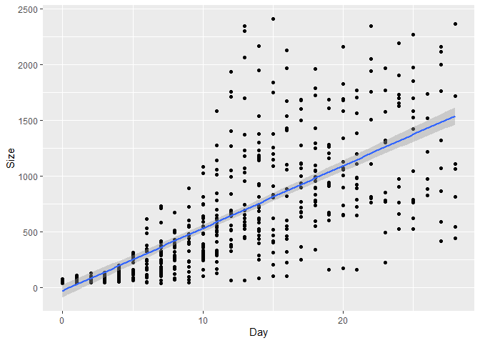

Getting Started with R and RStudio
================
Dominic Bordelon, Research Data Librarian, University of Pittsburgh
Library System
January 30, 2023

# Getting Started with R and RStudio

Welcome!

## Agenda

1.  About the trainer
2.  What are R and RStudio? What can you do with them?
3.  RStudio Orientation
4.  Packages: what they are and installing them
5.  Import a spreadsheet as an R data frame
6.  Basic calculations and functions in R; important data structures
7.  Potential next steps

## About the trainer

**Dominic Bordelon**, Research Data Librarian  
University Library System – Digital Scholarship Services  
<dbordelon@pitt.edu>, <https://pitt.libguides.com/dominicbordelon>

Previously: background in humanities and libraries + self-taught coding
interest ➝ library IT and web development (\~5 yrs) ➝ Research Data
Librarian at Pitt since Nov 2019

Support for various “data work”…

-   data management planning (esp. for grant proposals)
-   data cleaning, processing, analysis, visualization using tools like
    R and Python
-   project version control using Git and GitHub
-   understanding IT terms, how the internet works (HTTP, APIs), etc.,
    as it pertains to your research
-   data sharing and other Open Science topics

…via consultations ([book
here](https://pitt.libcal.com/appointments/research_data_librarian));
workshops for the Pitt community; on-request training

[Carpentries](https://carpentries.org/)[^1] Certified Instructor

Returning part-time undergrad in Ecology

## What are R and RStudio?


**R** is…

-   a tool for statistical analysis and visualization dating back to
    1993
    -   derived a free alternative to IBM’s S language
-   a programming language[^2]
-   text-based command interface
    
    it runs on the console/command line
-   biased towards tabular data and matrices (in practice)
-   free, open-source software (FOSS) stewarded by the nonprofit,
    Vienna-based R Foundation
-   full name: The R Project for Statistical Computing


**RStudio (Desktop)** is…

-   an “integrated development environment” for analysis and programming
    in R and Python
-   = a graphical layer of software to facilitate our usage of R
-   Posit (until recently, called RStudio) is a Boston-based public
    benefit corporation, founded 2009, which makes both FOSS and
    commercial software[^3] and offers hosted services

### What can you do with R and RStudio?

Let’s follow the research data life cycle…

<figure>

<figcaption aria-hidden="true">Research Data Lifecycle; source: <a
href="https://researchdata.princeton.edu/research-lifecycle-guide/research-lifecycle-guide">Princeton
Research Data Service</a></figcaption>
</figure>

#### Data collection from online sources

-   API == Application Programming Interface
    -   Many open data sources are accessible programmatically via HTTP
        APIs
    -   You can dynamically query the remote database and get the
        matching data back in a structured way, as opposed to needing to
        download many files.
    -   Some examples: Google Maps, Twitter, Fitbit, Census Reporter,
        COVID-19 Data Portal, NCI Genomic Data Commons
    -   Package: [httr](https://httr.r-lib.org/)
-   Web scraping
    -   Extracting information from web page HTML

    -   Package: [rvest](https://rvest.tidyverse.org/)

#### Data cleaning, processing, and reshaping

For example:

-   standardizing mixed column names, removing extra white space from
    cells
-   splitting and combining columns
-   detecting and handling missing values and outliers
-   reshaping tabular data



Packages: [dplyr](https://dplyr.tidyverse.org/),
[tidyr](https://tidyr.tidyverse.org/)

#### Combining data from different sources

Table joins (for example: a table of geospatial observations could be
joined to a table of census tracts

Connect to relational databases like MySQL, PostgresSQL, Oracle, etc.

Packages: [dplyr](https://dplyr.tidyverse.org/),
[dbplyr](https://dbplyr.tidyverse.org/)

#### Types of data analysis and visualization

Statistical modeling

Machine Learning (e.g., TensorFlow)

Geocomputation, GIS:

-   Mapping (raster and vector)
-   Analysis and statistical modeling

Computational text analysis: tokenization, TF-IDF, topic modeling

Computational genomics:

-   working with genomic intervals
-   high-throughput RNA-seq and ChIP-seq analysis
-   DNA methylation analysis

High-performance computing (e.g., Hadoop)

#### Make documents, slideshows, websites, books

-   [Literate
    programming](https://en.wikipedia.org/wiki/Literate_programming):
    mix narrative text, code, code outputs (e.g., viz or tables)
-   Hypertext: include images, links, embedded video, footnotes
-   Use
    
    (esp. for math formulas)
    -   Inline mode example:[^4]
        

    -   Display mode example:[^5]

^n + 1}")

-   Make inline citations and bibliography using Zotero and/or .bib
    files
-   One input file, many potential output formats (PDF, HTML, Word…)
-   Presentations can be PPTX, PDF, or browser-based ([demo
    here](https://quarto.org/docs/presentations/revealjs/demo/))
-   For many more examples check out the [RMarkdown
    gallery](https://rmarkdown.rstudio.com/gallery.html) or the [Quarto
    gallery](https://quarto.org/docs/gallery/)

#### Dashboards and other web apps

-   “Dashboard”: in-browser interface with viz of live, refreshing data
    (e.g., from a database), often with some interactivity, like
    filtering, drilling down, highlighting based on mouse cursor, etc.
-   Packages: [Shiny](https://shiny.rstudio.com/),
    [plotly](https://plotly.com/r/)
-   For lots of examples, check out the [Shiny
    Gallery](https://shiny.rstudio.com/gallery/)

## RStudio Orientation

### Panes

-   Bottom left: Console
    -   Run commands instantly in R
        
        see command-line output
    -   Command history (press up arrow key)
-   Top left: Source/Editor
    -   Where you open files (tabbed)
    -   Write a script (multiple lines of R code), which you can *Run* (
        = RStudio sends each line of the script to the console pane)
    -   Can also be used to write documents in plain text or markdown,
        or *notebooks* in RMarkdown
-   Top right: Environment, History
    -   Global Environment = workspace of your current R session
-   Bottom right: Help, Working Directory

### RMarkdown/Quarto

-   This document is written in Quarto format, which is the most recent
    iteration of RMarkdown. A file written in RMarkdown is also called
    *an RMarkdown Notebook* or just *an R Notebook*.
-   Extends the popular
    [markdown](https://daringfireball.net/projects/markdown/) format
    (seen on Wikipedia and GitHub) by enabling the author to include
    executable code *chunks* like the one below
-   Switch between Source and Visual editors (buttons near top left of
    editor pane)

A code chunk:

``` r
1+4
```

    [1] 5

``` r
sqrt(144)
```

    [1] 12

### Configuration

-   Tools \> Global Options…
-   Many options can also be configured at Project level
-   Keyboard shortcuts are very handy! Tools \> Keyboard Shortcuts Help

### What kind of files will you open in RStudio?

-   An **R Notebook** or RMarkdown document (**.Rmd**) intermixes R code
    and text formatted with markdown; the newest version is the **Quarto
    document** (**.qmd**)
-   An **R script** (**.R**) is a plain-text file that can be executed
    by R directly. However, because the file must be parseable, this
    means that the only permitted “natural language” is in code
    comments.
-   An [**R
    Project**](https://support.rstudio.com/hc/en-us/articles/200526207-Using-RStudio-Projects)
    (**.Rproj**) file lives in the directory for a given project, and it
    holds information like command history and settings. They are
    optional but recommended.
-   An .**RData** file is a workspace (session) snapshot
-   An **.rds** file is an R data structure, i.e., an R object which has
    been saved to the filesystem.

Of course, you will also be loading files in whatever format your data
take (spreadsheets, shapefiles, etc.).

Protip: make sure your operating system is set to display *all* file
extensions!

-   [Windows
    instructions](https://support.microsoft.com/en-us/windows/common-file-name-extensions-in-windows-da4a4430-8e76-89c5-59f7-1cdbbc75cb01)
-   [macOS
    instructions](https://support.apple.com/guide/mac-help/show-or-hide-filename-extensions-on-mac-mchlp2304/mac#:~:text=On%20your%20Mac%2C%20select%20a,or%20deselect%20%E2%80%9CHide%20extension.%E2%80%9D)

### Ways to run your session

-   Notebooks provide an easy route which lets you stay in just the
    Editor pane (ignore the Console)
    -   Whenever you get to code you want to run, you can run a single
        line (Ctrl-Enter or Cmd-Enter), or run the whole chunk. Either
        way, the output appears below the chunk.
    -   All code *is* sent to the Console if you really need to see it.
-   You can use the Console directly
    -   …but make sure to save your work somewhere!
    -   I only recommend this for quick calculations and one-liners that
        you don’t need to save.
-   You can have an R script open, and send its content (line-by-line or
    all at once) down to the Console.
    -   Better than using the Console directly for reproducibility

    -   But less convenient than notebooks (narrative can only exist as
        “comments” with \#; see “working directory” below)

Your R session always has a **working directory**, i.e., where R is
“looking” in the filesystem. If you’re using a notebook, you probably
don’t have to worry about the working directory thanks to RStudio
settings (woohoo!). However, **when running .R scripts or working in the
console directly, you must check/set your working directory!** The
working directory is an absolute file path,

Use `getwd()` to see what your current working directory is. Use
`setwd()` to set the working directory—or much easier, use the Files
Pane (bottom right) to browse and set the working directory.

    > getwd()
    [1] "C:/Users/djb190/Documents"

Similar to a notebook, .Rproj (R Project) files take care of the working
directory for you: when you open the RProj file, a new R session will
launch and automatically set the working directory specified in the
RProj file.

One last important note about R sessions: RStudio has a convenience
feature to snapshot your session environment before quitting, which can
then be loaded at next startup.

## Packages: what they are and installing them

In addition to R’s built-in functionality (“base R”), we can also
leverage work done by the community, released as **packages**. The
developer of a package loads it onto a public repository **CRAN** (the
Comprehensive R Archive Network). From CRAN, R users can install the
package onto their own computer.

Packages are typically built for a specific purpose or to collect a
specific set of functions. Here are some popular examples:

-   ggplot2: makes plots (using a “grammar of graphics”)
-   dplyr: filters, sorts, and modifies datasets
-   shiny: creates web applications, especially dashboards
-   stringr: has tools to help you work with character strings (text)
-   tmap: creates maps

### To install a package

-   Using your mouse:
    -   in the bottom right pane, click the Packages tab
    -   click the Install button at the top of the pane
    -   type the name of the package you want to install (example:
        `stringr`)
    -   click Install
-   Running code: `install.packages("stringr")` (replace `stringr` with
    the name of your desired package)

### To use a package

Once installed, a package needs to be activated before you can use it.

-   Using your mouse:
    -   in the bottom right pane, click the Packages tab
    -   find the name of the package you want to activate (by scrolling
        or searching in the top-right box), example: `stringr`
    -   click the check-box next to the package name
-   Running code: `library(stringr)`

You will need to reactivate the package every time you start a new R
session.

### Let’s install and attach (activate) tidyverse

“tidyverse” is a popular collection of packages–and we’re about to use
it in the next section, so let’s install and activate:

``` r
install.packages("tidyverse")
install.packages("readxl")
```

``` r
library(tidyverse)
```

    ── Attaching packages ─────────────────────────────────────── tidyverse 1.3.2 ──
    ✔ ggplot2 3.4.0      ✔ purrr   1.0.0 
    ✔ tibble  3.1.8      ✔ dplyr   1.0.10
    ✔ tidyr   1.2.1      ✔ stringr 1.5.0 
    ✔ readr   2.1.3      ✔ forcats 0.5.2 
    ── Conflicts ────────────────────────────────────────── tidyverse_conflicts() ──
    ✖ dplyr::filter() masks stats::filter()
    ✖ dplyr::lag()    masks stats::lag()

``` r
library(readxl)
```

## Import a spreadsheet as an R data frame

Easiest is the Import Dataset feature in the Environment pane (top
right).

The Import Dataset feature generates code, which you can paste into a
code chunk, like the one below:

``` r
tg <- read_excel("data/tumorgrowth.xlsx", 
           sheet = "AnalysisData")
```

This way, the file-loading step will be saved in your document, so that
you can easily recreate your session.

## Basic calculations and functions in R; important data structures

You can use R as a calculator, including with many algebraic functions:

``` r
7.3 * 4^3 + 139
```

    [1] 606.2

``` r
log(3)
```

    [1] 1.098612

``` r
log(3, base=exp(2))
```

    [1] 0.5493061

``` r
exp(2)
```

    [1] 7.389056

(Of course, you can also write your own functions.) To learn more about
a function, like `log()`, or search out a function you need, use the
Help pane (bottom right).

R’s fundamental data structure is the **vector**, an ordered collection
of values all sharing the same data type (numeric, character, boolean,
etc.). We can create a vector with the `c()` (“combine”) function. Doing
calculations or running a function on a vector will usually either 1)
apply piecewise to each item in the vector or 2) apply to all items in
the vector, as appropriate. In case \#1, we can say the function is
“vectorized.”

``` r
c(1.4, 5.7, 3.2, 2.6, 1.0, 0, -1.9)
```

    [1]  1.4  5.7  3.2  2.6  1.0  0.0 -1.9

``` r
# In order to use these values more easily,
# I will store the vector as an object in my session environment:
observations <- c(1.4, 5.7, 3.2, 2.6, 1.0, 0, -1.9)
observations
```

    [1]  1.4  5.7  3.2  2.6  1.0  0.0 -1.9

``` r
# Piecewise application:
big_obs <- observations * 100

# Cumulative application:
median(observations)
```

    [1] 1.4

``` r
mean(observations)
```

    [1] 1.714286

``` r
sd(observations)
```

    [1] 2.432028

``` r
# One of the most important R functions! summary()
summary(observations)
```

       Min. 1st Qu.  Median    Mean 3rd Qu.    Max. 
     -1.900   0.500   1.400   1.714   2.900   5.700 

``` r
summary(tg)
```

         Grp                Group             ID             Day       
     Length:574         Min.   :1.000   Min.   :101.0   Min.   : 0.00  
     Class :character   1st Qu.:2.000   1st Qu.:203.0   1st Qu.: 5.00  
     Mode  :character   Median :3.000   Median :302.0   Median :11.00  
                        Mean   :2.617   Mean   :266.9   Mean   :11.36  
                        3rd Qu.:4.000   3rd Qu.:401.0   3rd Qu.:17.00  
                        Max.   :4.000   Max.   :409.0   Max.   :28.00  
          Size       
     Min.   :  38.5  
     1st Qu.: 114.0  
     Median : 431.5  
     Mean   : 607.5  
     3rd Qu.: 914.2  
     Max.   :2405.7  

### Data frames

A **data frame** is structured in rows (“observations”) and columns
(“variables”). This can also be called tabular data. Our spreadsheet
above is imported as a data frame. Just beneath the surface, however,
each column is really just a vector.

Let’s use the `View()` and `str()` functions to examine the data frame:

``` r
View(tg)

str(tg)
```

    tibble [574 × 5] (S3: tbl_df/tbl/data.frame)
     $ Grp  : chr [1:574] "1.CTR" "1.CTR" "1.CTR" "1.CTR" ...
     $ Group: num [1:574] 1 1 1 1 1 1 1 1 1 1 ...
     $ ID   : num [1:574] 101 101 101 101 101 101 101 101 101 101 ...
     $ Day  : num [1:574] 0 3 4 5 6 7 10 11 12 13 ...
     $ Size : num [1:574] 41.8 85 114 162.3 178.3 ...

You can refer to one variable (column) in a data frame with the **`$`**
(dollar sign):

``` r
tg$Size
```

      [1]   41.8   85.0  114.0  162.3  178.3  325.0  623.7  648.4  835.9 1030.4
     [11] 1141.8 1499.9 1429.3 1609.3 1678.3 1564.0   79.4  110.3  201.3  255.3
     [21]  349.1  357.5  670.0  624.3  640.6  618.8  584.9  809.7 1249.7 1262.2
     [31] 1336.8 1563.7   44.8   67.5   55.8   82.8  106.8  309.5  355.9  554.8
     [41]  740.4 1012.1 1948.2 2405.7   67.7   92.4   77.7  107.4  147.1  226.1
     [51]  285.3  541.5  551.9  609.8 1230.5 1839.6 1964.2   54.7   61.1   75.3
     [61]  112.5  117.8  164.9  816.2  846.4 1403.6 1699.3 2162.8   60.0   74.2
     [71]   98.9  103.3  106.4  166.3  269.2  478.4  356.4  498.8  915.8 1086.6
     [81] 2125.1   46.8  162.6  264.5  253.1  419.3 1273.5 1712.0 2342.6   49.4
     [91]  123.2  286.5  484.9  584.5 1581.9 1930.6 2295.9   49.1   65.6   88.9
    [101]  135.4  171.9  177.3  388.0  466.7  557.0  455.5  624.1  995.2 1157.6
    [111] 1069.7 1194.4 1725.8 1524.9 1737.7 1998.3   60.6   75.7   75.8  158.7
    [121]  306.2  397.4  398.2  639.3  556.4  815.9  907.9 1104.2 1275.0 1290.9
    [131] 2046.7   41.5   41.8   43.2   46.0   48.7   66.5   82.2   94.1  162.7
    [141]  169.9  398.7  416.0  526.7  716.3  734.9 1938.5   46.8   46.4   48.8
    [151]   56.7  113.9  231.8  318.3  413.1  747.4  700.4 1374.8 1374.1 1668.4
    [161] 1598.4 1725.1   39.5   71.2   62.4   84.8   88.6  138.0  270.3  310.7
    [171]  385.5  552.5  468.9  766.6  896.0 1279.0 1582.3 1701.4   53.5   41.2
    [181]   52.2   61.6   77.1  102.8   85.9   70.3  105.2  129.9  291.3  315.4
    [191]  322.5  768.1 1108.6 1321.0 1624.3 1853.5   43.5   50.2   56.5   87.0
    [201]   53.5   38.5   69.1   46.3   66.5   62.4   83.6  102.6  100.9  163.0
    [211]  172.4  162.5  223.7  416.0  445.2   64.4   63.9   76.3   85.8  186.3
    [221]  291.9  381.9  469.5  590.2  782.9 1182.8 1194.7 1407.2 1677.7 1784.9
    [231]   47.5   48.6   75.1   77.7  128.0  123.5  167.1  144.4  294.6  318.0
    [241]  580.5  621.6  601.6 1066.5  981.1 1380.3 1507.9 1767.9 2269.3   71.7
    [251]  134.0  172.2  247.4  239.4  604.9  538.2  583.5  664.8  743.5 1054.9
    [261]  998.4  890.1 1203.9 1123.9 1302.3 1654.0 1697.6 2114.6   44.1  104.2
    [271]  129.3  304.9  533.2  732.5 1083.6 1141.7 1751.9 2058.7   42.1   98.7
    [281]   59.7   80.2   87.8  173.2  253.1  287.5  427.4  589.5  525.1  934.3
    [291] 1041.9  920.7 1003.3  920.7 1584.5 1734.4 1760.5 2362.4   42.5   49.8
    [301]   58.5   69.3   97.4  133.8  294.6  322.7  324.8  442.4  505.0  632.7
    [311]  594.8  603.7  646.5  649.3 1044.8 1219.9 1316.1 1714.0   56.9  129.6
    [321]  106.2  120.6  170.3  239.0  743.9  697.5  990.8 1066.4 1167.2 1958.9
    [331]   46.7   50.9   59.2  139.8  159.3  183.4  244.4  328.0  368.1  455.3
    [341]  397.6  519.8  463.5  650.5  979.3  761.1  853.0 1518.8 2157.4   51.2
    [351]   88.5  128.7  315.7  326.7  376.2  429.3  723.6 1051.3 1177.5 1297.6
    [361] 1254.5 1426.6 2159.6   44.0   84.1   80.1   66.8   90.0  147.7  334.2
    [371]  476.9  517.9  651.8  616.6 1108.4  955.3  909.4 1071.8  988.0 1970.2
    [381]   59.8   84.0  277.2  612.4  712.3 1055.3 1268.3  956.9  929.9   40.7
    [391]   63.5   55.9   89.1   98.7  137.7  303.3  410.4  514.4  565.4  611.3
    [401]  677.0  778.9  656.5  737.5  721.4  902.4  776.4  882.6  865.8 1065.0
    [411]   58.2   73.1   91.0   86.9  375.7  405.0  511.0  891.6 1022.3 1372.7
    [421] 1535.9 1748.5 1538.9 1684.1 1690.8 1764.8 1754.0 1964.6 2188.7   41.3
    [431]   63.4  102.6  130.0  286.2  372.3  440.0  490.0  511.4  719.9  832.3
    [441]  822.1  899.5 1096.0 1577.1 1904.1   53.5   60.9  117.0  122.7   47.7
    [451]  114.1   45.8   57.4   46.3  118.3  209.0  245.5  424.4  389.4  689.8
    [461]  624.1  731.3  811.3  882.4  898.8  887.2  814.5  779.7  828.9  588.6
    [471]  543.3   48.2   60.3   59.3   90.6   66.7  149.6  121.1  186.0  323.6
    [481]  332.2  609.0  467.4  548.0  768.8  802.1  766.2  657.1  619.2  810.7
    [491]   47.7   98.2   92.8  145.1  167.0  252.7  479.4  541.1  681.2  527.1
    [501]  685.7  673.3  833.1  672.7  651.5  785.3  972.4  786.5  976.6 1070.9
    [511] 1109.9   69.2   69.5  144.8  224.4  319.8  296.1  494.6 1227.7 1144.6
    [521] 1144.6 1685.4 1827.0 2343.0   43.9   58.5   45.6   77.9  224.7  183.7
    [531]  233.7  289.4  287.9  433.7  402.6  434.9  364.1  551.6  769.1  760.4
    [541]  760.4   59.3   92.6   92.5  169.3  218.1  257.2  236.2  243.7  229.2
    [551]  250.1  208.4  222.8  249.0  338.9  495.5  523.3  523.3   51.1   78.0
    [561]  107.4  128.0  167.3  219.8  375.6  645.9  691.4 1114.2 1050.4  940.6
    [571] 1057.0 1107.6 1694.2 1423.6

### Exercise 1

A handy function is `help()`, which queries R’s documentation system.
Most commonly, you’ll look up functions. You can search by running
`help(topic)` or `?topic`, e.g., `?sqrt`. Notice that the result will
appear in the Help pane.

1.  There is confusion among some R users what the “c” in the function
    `c()` stands for. Using the help system, what does `c()` do? What do
    you think “c” stands for?

<!-- -->

2.  Create a vector of arbitrary patient ages and store it as an object
    called `ages`.

<!-- -->

3.  What do you estimate is the mean age? Calculate it using `mean()`.

<!-- -->

4.  What is the mean value of the `Size` variable in `tg`?

### Matrices

Vectors are one-dimensional. For 2+ dimensions, we need a **matrix**.

``` r
1:9     # the integer sequence 1 to 9, as a vector
```

    [1] 1 2 3 4 5 6 7 8 9

``` r
matrix(data = 1:9, nrow = 3, ncol = 3)
```

         [,1] [,2] [,3]
    [1,]    1    4    7
    [2,]    2    5    8
    [3,]    3    6    9

Can you do matrix algebra in R?
[Yes!](http://cda.psych.uiuc.edu/multivariate_fall_2011/matrix_algebra_in_r.pdf)

### Lists

Lists are collections of items; unlike vectors, they are potentially
heterogeneous. You can also give a name to each item in a list if
desired. Many specialized data structures are actually lists with
special attributes and functionality.

``` r
list(sex = c("F", "M"),
     group = c("Control", "1", "2", "3"),
     "cm",
     25:35)
```

    $sex
    [1] "F" "M"

    $group
    [1] "Control" "1"       "2"       "3"      

    [[3]]
    [1] "cm"

    [[4]]
     [1] 25 26 27 28 29 30 31 32 33 34 35

### Factors

A **factor** is a vector which represents a categorical variable, i.e.,
that there are only a finite number of possible values. Examples of
categorical variables:

-   type of thing
-   which treatment group (or control group)
-   which observation site (e.g., “Plot A”—but not geographic
    coordinates)
-   biological sex (although note that \>2 categories may be coded)
-   gender (although note that a binary is not necessarily presumed)
-   month, day of week, week number of year
-   shoe size, athletic weight class (but not: height, weight)
-   Likert scale (e.g., “on a scale of 1 to 5, where 1 is strongly
    disaree and 5 is strongly agree…”)

The possible values of a factor are its **levels**. Levels may be
**ordered** (e.g., month) or unordered (e.g., sex, eye color).

To create a factor, use the `factor()` function. R will automatically
determine the levels, but you can specify them, as well as whether they
are ordered.

``` r
c("Control", "Group 1", "Group 2")
```

    [1] "Control" "Group 1" "Group 2"

``` r
# turning a vector of values into a factor:
treatment_grp <- factor(c("Control", "Group 1", "Group 2", "Group 1", "Control", "Control", "Group 2", "Group 2", "Group 3"))
# note that when we print the factor, it tells us the levels:
treatment_grp
```

    [1] Control Group 1 Group 2 Group 1 Control Control Group 2 Group 2 Group 3
    Levels: Control Group 1 Group 2 Group 3

``` r
# summary includes a count for each level:
summary(treatment_grp)
```

    Control Group 1 Group 2 Group 3 
          3       2       3       1 

Sometimes your dataset might have categorical data coded numerically
(e.g., `1` for females and `2` for males), such that you will also want
to have a way to store human-readable **labels**.

``` r
factor(c(1, 2, 1, 3, 1, 2, 1, 2, 2, 3, 2, 1, 2, 3, 1, 1),
       levels = c("1", "2", "3"),
       labels = c("Control", "Group 1", "Group 2"))
```

     [1] Control Group 1 Control Group 2 Control Group 1 Control Group 1 Group 1
    [10] Group 2 Group 1 Control Group 1 Group 2 Control Control
    Levels: Control Group 1 Group 2

## Objects and functions

When we give R a command, it usually returns an **object** of some kind.
We can usually see a representation of this object in the console when R
returns the object.

To store the object in memory, in order to view it more than once or
modify it, we will need to assign a name to the object. *(Note: saving
to memory ≠ saving to disk!)* We’ll use the **assignment operator**,
written **`<-`**, between our new object’s name and the function call.
For example:

``` r
c(41.8, 85.0, 114.0)      # creates a vector with three values
```

    [1]  41.8  85.0 114.0

``` r
size <- c(41.8, 85.0, 114.0)      # creates the vector and saves it to an object called "size"

# note the "size" object in your Environment tab!
size
```

    [1]  41.8  85.0 114.0

### Data types

On object’s data type determines what kinds of operations we can do on
the object. For example, numeric and character vectors have different
behaviors:

``` r
group <- c("Group 1", "Group 2", "Group 1", "Group 1")

size * 2
group * 2   # error!
```

To find out an object’s data type, you can see it listed in the
Environment tab (`chr`, `num`) or run the `typeof()` function.

### Functions

A function can have one or more **arguments**; for example, the `sqrt()`
function takes an `x` argument, which we could also write as `sqrt(x)`.
In the code chunk below, we use the `size` object for the `x` argument:

``` r
sqrt(size)
```

    [1]  6.465292  9.219544 10.677078

``` r
# R also supports "named arguments":
sqrt(x = size)
```

    [1]  6.465292  9.219544 10.677078

We say that a function **returns** its output (often an object);
`sqrt(16)` returns `4`.

You can also write your own functions, using **`function()`**. Here is a
function that raises `x` to the `y` power:

``` r
my_new_function <- function(x, y) {
  return(x^y)
}

my_new_function(2, 3)     #   == 2^3
```

    [1] 8

Modeling also takes place via functions. An example is `lm()` (“linear
model”), which fits a linear regression model. The output of such a
function is a model object. Once you have your model stored as an
object, you can examine the model’s properties, plot the regression line
and error, and generate predictions.

``` r
tg_model <- lm(Size ~ Day, data=tg)

# printing our model gives the Y intercept (-28.83) and slope (55.99)
tg_model
```


    Call:
    lm(formula = Size ~ Day, data = tg)

    Coefficients:
    (Intercept)          Day  
         -28.83        55.99  

``` r
# a summary of the model gives further info:
summary(tg_model)
```


    Call:
    lm(formula = Size ~ Day, data = tg)

    Residuals:
         Min       1Q   Median       3Q      Max 
    -1093.79  -197.90   -38.78    88.50  1643.51 

    Coefficients:
                Estimate Std. Error t value Pr(>|t|)    
    (Intercept)  -28.828     29.122   -0.99    0.323    
    Day           55.993      2.133   26.25   <2e-16 ***
    ---
    Signif. codes:  0 '***' 0.001 '**' 0.01 '*' 0.05 '.' 0.1 ' ' 1

    Residual standard error: 386.7 on 572 degrees of freedom
    Multiple R-squared:  0.5464,    Adjusted R-squared:  0.5456 
    F-statistic: 689.1 on 1 and 572 DF,  p-value: < 2.2e-16

``` r
# use the model to make predictions:
# what is the predicted tumor size on day 30? 50?
predict(tg_model, 
        newdata = data.frame(Day = c(30, 50)))
```

           1        2 
    1650.976 2770.846 

### Quick, easy Base R plots

Base R has some functions to quickly plot vectors (and/or columns of
dataframes): `hist()` gives us a histogram, and `plot()` gives us a
scatter plot.

``` r
hist(tg$Size, main="Tumor size distribution")
```



``` r
plot(x=tg$Day, y=tg$Size)
```



``` r
summary(lm(tg$Size ~ tg$Day))
```


    Call:
    lm(formula = tg$Size ~ tg$Day)

    Residuals:
         Min       1Q   Median       3Q      Max 
    -1093.79  -197.90   -38.78    88.50  1643.51 

    Coefficients:
                Estimate Std. Error t value Pr(>|t|)    
    (Intercept)  -28.828     29.122   -0.99    0.323    
    tg$Day        55.993      2.133   26.25   <2e-16 ***
    ---
    Signif. codes:  0 '***' 0.001 '**' 0.01 '*' 0.05 '.' 0.1 ' ' 1

    Residual standard error: 386.7 on 572 degrees of freedom
    Multiple R-squared:  0.5464,    Adjusted R-squared:  0.5456 
    F-statistic: 689.1 on 1 and 572 DF,  p-value: < 2.2e-16

For more control over your visualizations than what base R provides,
check out the hugely popular ggplot2 library.

### An example ggplot

You’ll notice that ggplot is more verbose, but it is also more powerful.
Below, we plot a scatter plot (`geom_point()`) and add a smoother
(`geom_smooth()`) which fits and plots a model. Notice that the second
plot applies a different smoother method, `lm()`.

``` r
tg %>% 
  ggplot(mapping=aes(x=Day, y=Size)) +
  geom_point() +
  geom_smooth()
```

    `geom_smooth()` using method = 'loess' and formula = 'y ~ x'



``` r
tg %>% 
  ggplot(mapping=aes(x=Day, y=Size)) +
  geom_point() +
  geom_smooth(method="lm")
```

    `geom_smooth()` using formula = 'y ~ x'



### Exercise 2

1.  Consider:

``` r
my_seq <- c(1, 2, 3)
my_seq <- c(my_seq, 4, 5)    # predict my_seq's value

my_seq <- c(my_seq, 6, c(7, 8))    # and here?
```

2.  Consider the factor in the code chunk below. Does `bases` have the
    value you expect? If not: what do you think is going on here?

``` r
bases <- factor(c("A", "C", "G", "A", "T", "G", "U", "C"), 
                levels=c("A", "C", "G", "T"))

bases
```

    [1] A    C    G    A    T    G    <NA> C   
    Levels: A C G T

## Next Steps

Today we learned about:

-   R and RStudio orientation
-   Importing spreadsheets
-   Data structures: data frames, vectors, matrices, lists, factors
-   Objects and functions

Upcoming events:

-   [R & RStudio Drop-In
    Hour](https://pitt.libcal.com/calendar/today/r-drop-in) (weekly,
    Tuesdays, 5–6pm)
-   Workshops in data wrangling and data visualization:
    <http://pi.tt/ds-workshops>
-   [Love Data Week 2023 at Pitt](https://lovedatapgh.io/)

Keep learning on your own:

-   Check out the free ebook [R for Data
    Science](https://r4ds.had.co.nz/), or [the Big Book of
    R](https://www.bigbookofr.com/)
-   [LinkedIn
    Learning](https://www.technology.pitt.edu/services/ondemand-training-linkedin-learning)
    is a Pitt-subscribed resource

[^1]: The Carpentries is a community which “builds global capacity in
    essential data and computational skills for conducting efficient,
    open, and reproducible research” through evidence-based instructor
    and mentor training and open learning materials
    ([link](https://carpentries.org/about/)). It is fiscally sponsored
    by Community Initiatives, a CA-based 501(c)(3) nonprofit.

[^2]: Programming language style: practical R usage tends to operate in
    the procedural and functional programming paradigms, rather than an
    object-oriented paradigm.

[^3]: FOSS products: RStudio Desktop, RStudio Server, Shiny Server, and
    many R packages. Commercial products: RStudio Team, RStudio
    Workbench.

[^4]: Shannon Diversity Index,
    https://en.wikipedia.org/wiki/Diversity_index#Shannon_index

[^5]: the Hill equation,
    <https://en.wikipedia.org/wiki/Hill_equation_(biochemistry)>
